# Table of contents

- [<a id="installation"></a>Installation](#a-idinstallationainstallation)
- [<a id="how-to-use"></a>How to use](#a-idhow-to-useahow-to-use)
  - [Template fields](#template-fields)
  - [Basic setups](#basic-setups)
    - [Form submission](#form-submission)
      - [Data Layer Variables](#data-layer-variables)
      - [Custom Javascript](#custom-javascript)
      - [Trigger](#trigger)
    - [Page browsing](#page-browsing)
  - [Troubleshooting](#troubleshooting)
    - [Events not appearing in the Automation](#events-not-appearing-in-the-automation)
    - [More information about using the preview mode:](#more-information-about-using-the-preview-mode)
    - [More information about getting forms to work with tag manager:](#more-information-about-getting-forms-to-work-with-tag-manager)

# <a id="installation"></a>Installation
If the Automation template is missing from the container, then it would need to be added first. **This can be done in 2 ways.**
1. Open your container and select from left bar `Templates`.

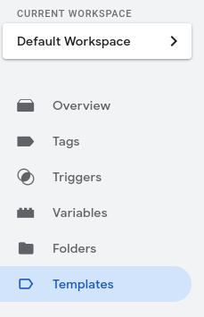

2. Click `Search Gallery` button, which is next to the `New` button.

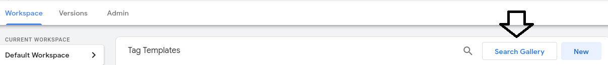

3. Click search button(magnifying glass) and type `LianaAutomation`.


4. LianaAutomation template should be now visible in the list and select it.
5. Press `Add to workspace` button.


6. In the pop-up window press `Add`.
7. Template should now be available in the container and therefore can be used as tag type.

**or**

1. Open your container and select from left bar `Tags`.

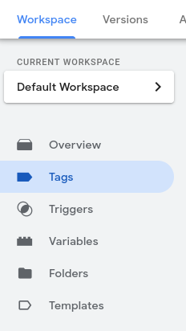

2. Press `New` button.

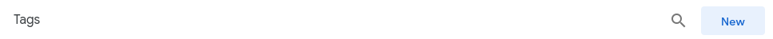

3. Click inside the `Tag Configuration` box.

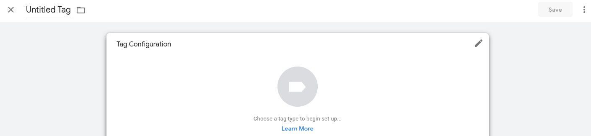

4. Press the blue box containing the text `Discover more tag types in the Community Template Gallery`.

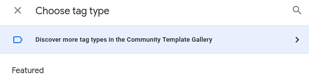

5. Click search button(magnifying glass) and type `LianaAutomation`.


6. LianaAutomation template should be now visible in the list and select it.
7. Press `Add to workspace` button.


8. In the pop-up window press `Add`.
9. Tag's type should be now `LianaAutomation` and the template is also imported into the container.

# <a id="how-to-use"></a>How to use

If LianaAutomation template is imported, then it can be selected when building new tag.

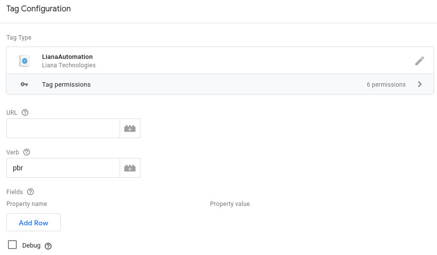
## Template fields
* **URL** - GTM URL from channel settings

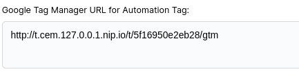
* **Verb** - Import with event name e.g. formsend.
* **Fields** - Properties of the event. At least one property is required.
* **Debug** - By default not checked. This can be used to investigate issues
  related to tag's execution. It provides useful information about e.g. what
  fields are about to be inserted, what cookie is used/fetched and execution's
  outcome. It utilizes `console.log()` to print debug info to console.

## Basic setups
### Form submission
Basic tag setup for collecting user data from form submissions could be something like this.

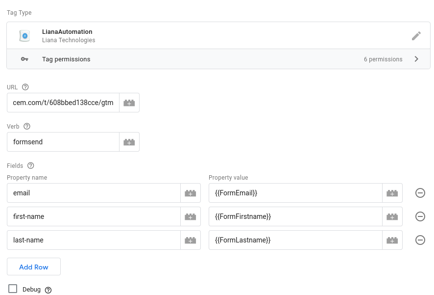

URL is copied from channel's setting page in our LianaAutomation installation.

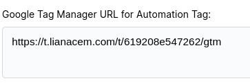

Verb is named as `formsend` to indicate that these events are from form submissions.
As property fields we are using 3 fields from the form. For every form field we defined new variable in `Variables` section.

Form value can be fetched either by using Data Layer Variables or by using custom javascript.

#### Data Layer Variables
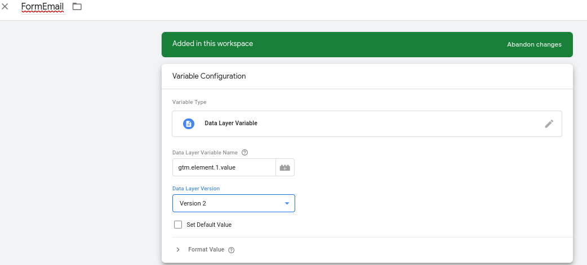

`Data Layer Variable` is selected for `Variable Type` and `gtm.element.1.value` is typed for `Data Layer Variable Name`. `gtm.element` object contains all
submitted form fields and counting starts from 0. For this example we assume that email field is the second input(from top to below) of the form, so we set 1. Other variables are configured similarly.
For more information about fetching form values by using Data Layer Variables:
* [Check "Step 1 – Set up Data Layer Variables"](https://organicdigital.co/blog/how-to-get-track-form-field-submission-values-in-analytics-using-gtm/)
* [Form Field Tracking](https://measureschool.com/form-field-tracking/)

#### Custom Javascript
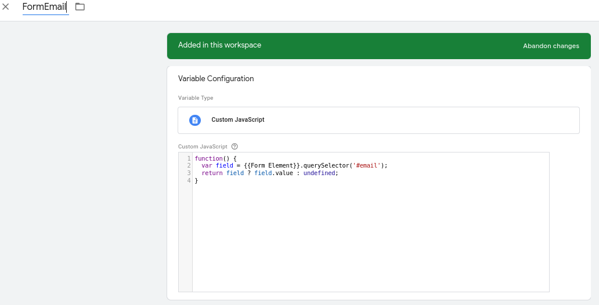

`Custom JavaScript` is selected for `Variable Type`. 

For its content:
```
function() {
  var field = {{Form Element}}.querySelector('#input-email');
  return field ? field.value : undefined;
}
```

First row contains `var field = {{Form Element}}.querySelector('#input-email');`. Here `input-email` is the id of the email field. To find ids, we right-click on the field and select `Inspect`.

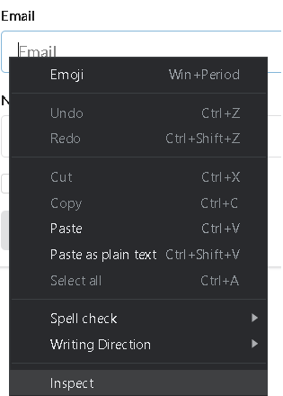

Field should be highlighted in the opened window. From the image we can see that field has for id the value `input-email`. 

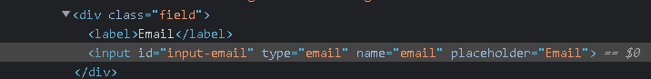

Similarly, ids for other fields can be found by using the same method.

In case input doesn't have id, then its name can be used instead, row mentioned above would have to be changed to
`var field = {{Form Element}}.querySelector('input[name="email"]');`

If `undefined` is returned for variable despite configuring it properly, then replacing `{{Form Element}}` with `document` or  `document.querySelector('#FORM ID HERE')` could be tried here. Form id can be found from inspecting form tag the same way as getting ids for inputs.

More information about using custom javascript can be found from
* [Field values](https://www.simoahava.com/analytics/track-form-engagement-with-google-tag-manager/#5-capture-field-value)

#### Trigger

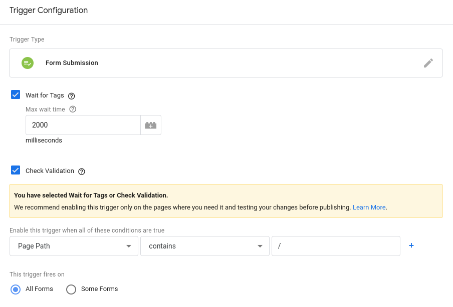

As trigger we are using `Form Submission` trigger with options: `Wait for Tags` with 3000 `Max wait time` to allow sufficient time for all tags to finish. `Check Validation`
checkbox is checked to fire only when form is submitted successfully. As only condition we have `Page Path` to contain `/`, which practically means that 
all forms in our website are caught. If specific form needs to be caught, when we could change this to have the URL of our webpage containing the form, also `This trigger fires on` can be changed to `Some Forms` to catch specific form e.g. by form's id.

### Page browsing
Someone viewed a page in our website.

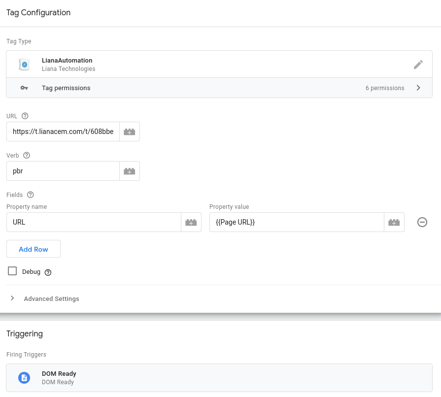

URL is copied from channel's setting page in our LianaAutomation installation.


Verb is named as `pbr`(page browsing) to indicate that these events are from browsing our website.
As property, we are using only field `URL`, which is the page's URL. Template requires at least one property. `DOM Ready` is set as trigger to fire tag during page view.


## Troubleshooting

### Events not appearing in the Automation
* Ensure channel has `import enabled` and `Tracking enabled` options checked.
* Check if tag is actually executed. With [preview mode](https://support.google.com/tagmanager/answer/6107056?hl=en) it is possible see every event that the tag manager detects
 and what tags are executed for each event.
  * If the tag in question is configured to be launched with form submission, then for cases like: 
    * `Form Submit` event appears in the preview mode after
    submitting the form. If that event is not visible, then there may be an issue between website's form and tag manager and would require further investigation.
    * `Form submit` event appears in tag manager, but tag's execution fails for some reason. Then issue may have to do with the implementation of the form. Form may during submission
not necessarily wait for tag to be executed completely causing it to be stopped before finishing. Here `Debug` checkbox(see [Template fields](#how-to-use)) of the template can be checked to see [log](https://developer.mozilla.org/en-US/docs/Tools/Browser_Console) of the tag during its execution to ensure that the issue 
has to do with the implementation of the form. Errors like `Script load failed` in the console is a strong indicator for an issue between form and tag manager.

### More information about using the preview mode:
  * https://www.analyticsmania.com/post/google-tag-manager-debug-mode/
  * https://www.searchenginejournal.com/google-tag-manager-preview-mode/385958/
### More information about getting forms to work with tag manager:
  * https://www.fusion75.com/blogposts/tracking-form-submissions-with-google-tag-manager
  * https://www.analyticsmania.com/post/google-tag-manager-form-tracking/
