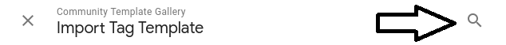
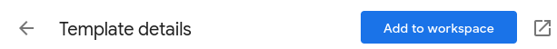

## Table of contents

* [Introduction](#introduction)
* [Installation](#installation)
* [How to use](#how-to-use)

# Introduction
Template is used to collect user data on your websites and send it to LianaAutomation. Gathered user data then can be used to create
segments. More information about [LianaAutomation](https://www.lianatech.com/solutions/marketing-automation/overview.html).
# Installation
If the template hasn't used previously, it would need to be added to the container first. **This can be done in 2 ways.**
1. Open your container and select from left bar `Templates`.

2. Click `Search Gallery` button, which is next to the `New` button.

4. Click search button(magnifying glass) and type `LianaAutomation`.

5. LianaAutomation template should be now visible in the list and select it.
6. Press `Add to workspace` button.

7. In the pop-up window press `Add`.
8. Template should now be available in the container and therefore can be used as tag type.

**or**

1. Open your container and select from left bar `Tags`.

2. Press `New` button.

3. Click inside the `Tag Configuration` box.

4. Press the blue box containing the text `Discover more tag types in the Community Template Gallery`.

5. Click search button(magnifying glass) and type `LianaAutomation`.

6. LianaAutomation template should be now visible in the list and select it.
7. Press `Add to workspace` button.

8. In the pop-up window press `Add`.
9. Tag's type should be now `LianaAutomation` and the template is also imported into the container.

# How to use

If LianaAutomation template is imported, then it can be selected when building new tag.

## Template fields
* **URL** - GTM URL from channel settings

* **Verb** - Import with event name e.g. formsend.
* **Fields** - Properties of the event.
* **Debug** - By default not checked. This can be used to investigate issues
  related to tag's execution. It provides useful information about e.g. what
  fields are about to be inserted, what cookie is used/fetched and execution's
  outcome. It utilizes `console.log()` to print debug info to console.

## Basic setups
### Form submission
Basic tag setup for collecting user data from form submissions could be something like this.

URL is copied from channel's setting page in our LianaAutomation installation. Verb is named as `formsend` to indicate that these events are from form submissions.
As property fields we are using 3 fields from the form. Form values are relayed to the tag as Data Layer Variables.

As trigger we are using `Form Submission` trigger with options: `Wait for Tags` with 3000 `Max wait time` to allow sufficient time for all tags to finish. `Check Validation`
checkbox is checked to fire only when form is submitted successfully. As only condition we have `Page Path` to contain `/`, which practically means that 
all forms in our website are caught. If specific form needs to be caught, when we could change this to have the URL of our webpage containing the form, also `This trigger fires on` can be changed to `Some Forms` to catch specific form e.g. by form's id.

### Page browsing
Someone viewed a page in our website.

URL is copied from channel's setting page in our LianaAutomation installation. Verb is named as `pbr`(page browsing) to indicate that these events are from browsing our website.
As property, we are using only field `URL`, which is the page's URL. Template is required to have at least one property. `DOM Ready` is set as trigger to fire tag during page view.